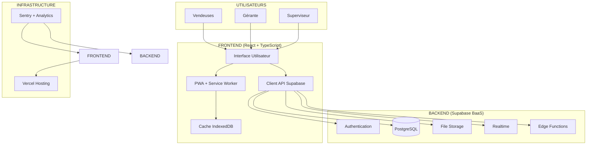
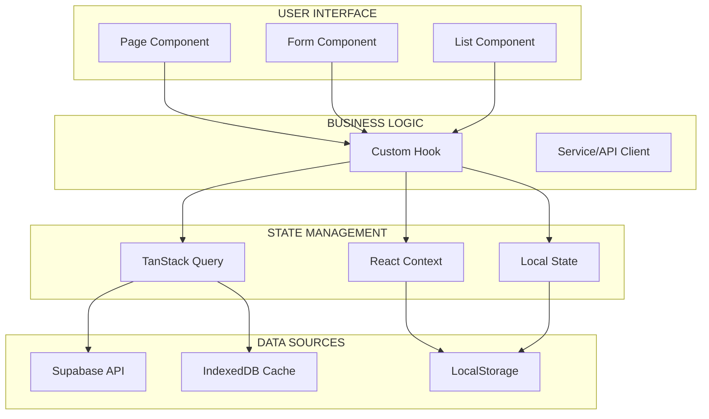
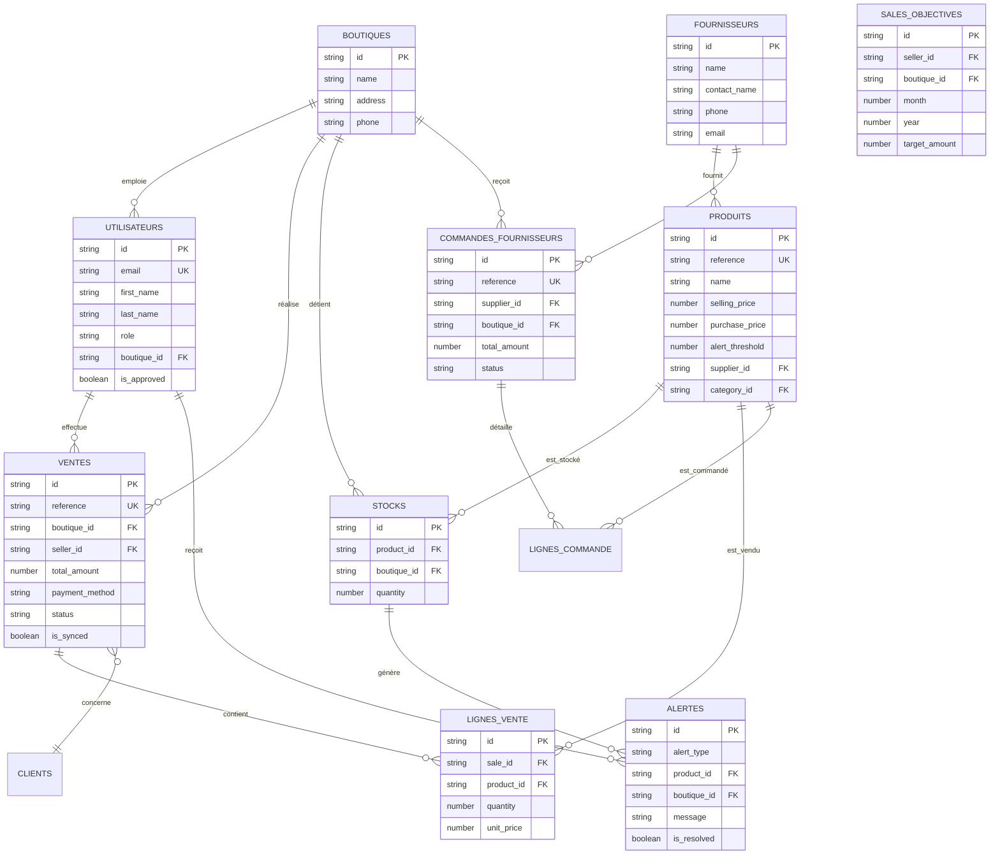
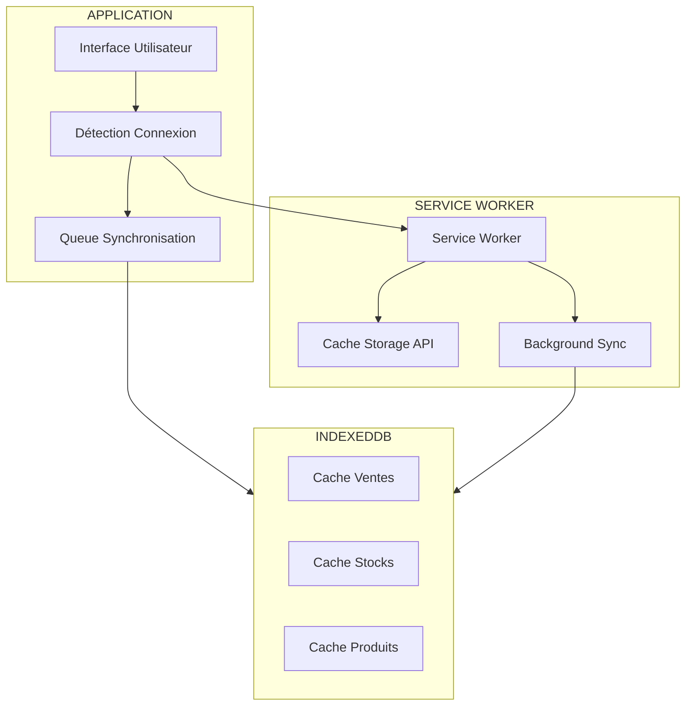
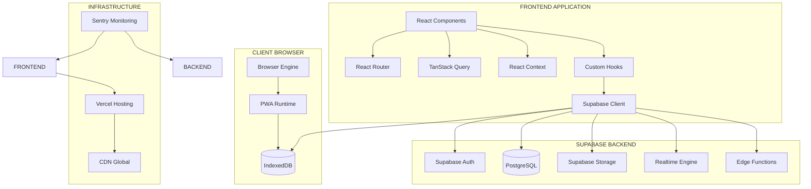
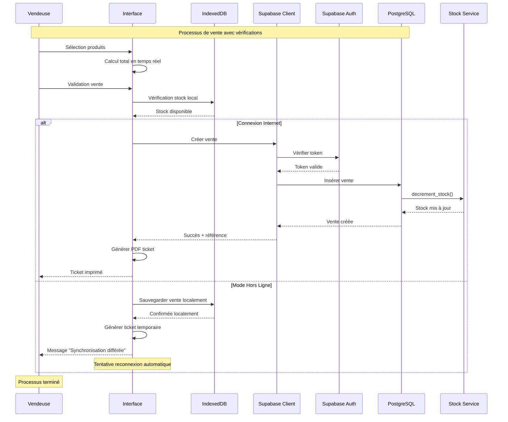

# 🏗️ ARCHITECTURE DÉTAILLÉE - NICKOPLUS PRO

Guide technique complet de l'architecture du système NICKOPLUS PRO.

---

## 📋 Table des Matières

1. [Vue d'Ensemble](#vue-densemble)
2. [Architecture Frontend](#architecture-frontend)
3. [Architecture Backend (Supabase)](#architecture-backend-supabase)
4. [Modèle de Données](#modèle-de-données)
5. [Mode Hors Ligne](#mode-hors-ligne)
6. [Sécurité](#sécurité)
7. [Performance](#performance)
8. [Diagrammes](#diagrammes)

---

## 🎯 Vue d'Ensemble

### Architecture Générale



### Principes Architecturaux

#### **1. Simplicité First**
- **Pas de backend personnalisé** : Utilisation de Supabase (BaaS) pour réduire la complexité
- **Frontend pur** : Toute la logique métier côté client
- **Serverless** : Pas de gestion de serveurs

#### **2. Progressive Web App (PWA)**
- **Mode hors ligne** : Fonctionnement sans connexion Internet
- **Installation native** : Application installable sur mobile/desktop
- **Performance** : Cache intelligent et lazy loading

#### **3. Type Safety**
- **TypeScript** partout pour éviter les bugs runtime
- **Types générés** automatiquement depuis Supabase
- **Validation stricte** des données

#### **4. Évolutivité**
- **Modularité** : Composants réutilisables
- **Separation of Concerns** : Hooks, services, composants séparés
- **State Management** : TanStack Query pour la gestion d'état serveur

---

## 🖥️ Architecture Frontend

### Stack Technique

| Technologie | Version | Rôle | Justification |
|-------------|---------|------|---------------|
| **React** | 18.x | Framework UI | Composants réutilisables, écosystème riche |
| **TypeScript** | 5.x | Type Safety | Prévention des bugs, DX améliorée |
| **Vite** | 5.x | Build Tool | Démarrage rapide, HMR ultra-rapide |
| **Tailwind CSS** | 3.x | Styling | Utilitaire-first, responsive, performant |
| **React Router** | 6.x | Routing | Navigation SPA fluide |
| **TanStack Query** | 5.x | State Management | Cache intelligent, synchronisation serveur |
| **Supabase JS** | 2.x | API Client | Client officiel, types générés |
| **IndexedDB** | - | Cache local | Stockage hors ligne structuré |
| **Vite PWA** | 1.x | PWA | Service Worker, manifest, offline |

### Structure des Dossiers

```
src/
├── components/                    # 🧩 Composants React
│   ├── ui/                         # Composants shadcn/ui (génériques)
│   │   ├── Button.tsx
│   │   ├── Input.tsx
│   │   ├── Card.tsx
│   │   └── Table.tsx
│   ├── ventes/                     # Composants métier ventes
│   │   ├── VenteForm.tsx
│   │   ├── VenteList.tsx
│   │   └── VenteDetails.tsx
│   ├── stocks/                     # Composants métier stocks
│   │   ├── StockCard.tsx
│   │   └── StockList.tsx
│   └── shared/                     # Composants partagés
│       ├── Header.tsx
│       ├── Sidebar.tsx
│       └── ConnectionIndicator.tsx
│
├── hooks/                         # 🎣 Custom React Hooks
│   ├── useAuth.ts                 # Gestion authentification
│   ├── useVentes.ts               # CRUD ventes
│   ├── useStocks.ts               # Gestion stocks
│   ├── useSync.ts                 # Synchronisation
│   └── useLocalStorage.ts         # Stockage local
│
├── lib/                           # 🔧 Utilitaires
│   ├── api.ts                     # Client API Supabase
│   ├── utils.ts                   # Fonctions utilitaires
│   ├── offlineStorage.ts          # Gestion cache IndexedDB
│   └── constants.ts               # Constantes application
│
├── pages/                         # 📄 Pages Next.js
│   ├── AuthPage.tsx               # Login/Register
│   ├── VendeurDashboard.tsx       # Dashboard vendeur
│   ├── NouvelleVente.tsx          # Création vente
│   ├── GestionStocks.tsx          # Consultation stocks
│   ├── AdminDashboard.tsx         # Dashboard admin
│   └── RapportVentes.tsx          # Rapports
│
├── types/                         # 📝 Types TypeScript
│   ├── vente.ts                   # Types ventes
│   ├── stock.ts                   # Types stocks
│   ├── user.ts                    # Types utilisateurs
│   └── index.ts                   # Exports globaux
│
├── contexts/                      # 🌐 React Contexts
│   ├── AuthContext.tsx            # Contexte authentification
│   └── SyncContext.tsx            # Contexte synchronisation
│
├── integrations/                  # 🔗 Intégrations externes
│   └── supabase/
│       ├── client.ts              # Configuration client
│       └── types.ts               # Types générés
│
└── styles/                        # 🎨 Styles globaux
    └── globals.css                # Tailwind + custom styles
```

### Flux de Données Frontend



### Gestion d'État

#### **1. TanStack Query (Données Serveur)**
```typescript
// ✅ BON : Cache intelligent, synchronisation automatique
const useVentes = (filters?: VenteFilters) => {
  return useQuery({
    queryKey: ['ventes', filters],
    queryFn: () => apiClient.ventes.list(filters),
    staleTime: 5 * 60 * 1000, // 5 minutes
    gcTime: 10 * 60 * 1000,   // 10 minutes
  });
};
```

#### **2. React Context (État Global)**
```typescript
// ✅ BON : Authentification, thème, synchronisation
const AuthContext = createContext<AuthContextType | null>(null);

export const useAuth = () => {
  const context = useContext(AuthContext);
  if (!context) {
    throw new Error('useAuth must be used within AuthProvider');
  }
  return context;
};
```

#### **3. Local State (État Local)**
```typescript
// ✅ BON : Formulaires, UI temporaire
const [searchTerm, setSearchTerm] = useState('');
const [isLoading, setIsLoading] = useState(false);
```

---

## 🗄️ Architecture Backend (Supabase)

### Services Supabase Utilisés

#### **1. Authentication**
- **Type** : Supabase Auth
- **Méthode** : Email + Password
- **JWT** : Tokens gérés automatiquement
- **Sessions** : Persistées automatiquement

#### **2. Database (PostgreSQL)**
- **Tables** : 12 tables principales
- **Rôles** : `admin`, `manager`, `seller`
- **RLS** : Row Level Security activé
- **Fonctions** : `decrement_stock()`, `has_role()`, `get_user_boutique()`

#### **3. Storage**
- **Utilisation** : PDFs tickets, images produits
- **Politiques** : RLS par utilisateur/boutique

#### **4. Realtime**
- **Utilisation** : Synchronisation multi-boutiques
- **Channels** : Par boutique pour les mises à jour

### Schéma de Base de Données



### Politiques RLS (Row Level Security)

#### **Table `ventes`**
```sql
-- Vendeurs voient uniquement leurs ventes
CREATE POLICY "Vendeurs voient leurs ventes" ON ventes
FOR SELECT USING (
  seller_id = auth.uid() OR
  EXISTS (
    SELECT 1 FROM user_roles
    WHERE user_id = auth.uid()
    AND role IN ('admin', 'manager')
  )
);

-- Admins voient tout
CREATE POLICY "Admins voient toutes les ventes" ON ventes
FOR ALL USING (
  EXISTS (
    SELECT 1 FROM user_roles
    WHERE user_id = auth.uid()
    AND role = 'admin'
  )
);
```

#### **Table `stocks`**
```sql
-- Utilisateurs voient stocks de leur boutique uniquement
CREATE POLICY "Stocks de sa boutique uniquement" ON stocks
FOR ALL USING (
  boutique_id = get_user_boutique(auth.uid())
);
```

### Fonctions PostgreSQL

#### **decrement_stock()**
```sql
CREATE OR REPLACE FUNCTION decrement_stock(
  _boutique_id TEXT,
  _product_id TEXT,
  _quantity INTEGER
) RETURNS BOOLEAN AS $$
DECLARE
  current_quantity INTEGER;
BEGIN
  -- Récupérer quantité actuelle
  SELECT quantity INTO current_quantity
  FROM stocks
  WHERE boutique_id = _boutique_id AND product_id = _product_id;

  -- Vérifier stock suffisant
  IF current_quantity < _quantity THEN
    RAISE EXCEPTION 'Stock insuffisant pour le produit %', _product_id;
  END IF;

  -- Décrémenter stock
  UPDATE stocks
  SET quantity = quantity - _quantity,
      updated_at = NOW()
  WHERE boutique_id = _boutique_id AND product_id = _product_id;

  RETURN TRUE;
END;
$$ LANGUAGE plpgsql SECURITY DEFINER;
```

---

## 📱 Mode Hors Ligne

### Architecture PWA



### Stratégie de Cache

#### **1. Cache des Données Statiques**
```typescript
// vite.config.ts
export default defineConfig({
  plugins: [
    vitePWA({
      registerType: 'autoUpdate',
      workbox: {
        globPatterns: ['**/*.{js,css,html,ico,png,svg}'],
        runtimeCaching: [
          {
            urlPattern: /^https:\/\/api\.supabase\.co\/.*/i,
            handler: 'NetworkFirst',
            options: {
              cacheName: 'supabase-api',
              expiration: {
                maxEntries: 100,
                maxAgeSeconds: 60 * 60 * 24 * 7, // 1 semaine
              },
            },
          },
        ],
      },
    }),
  ],
});
```

#### **2. Cache des Données Métier**
```typescript
// lib/offlineStorage.ts
export class OfflineStorage {
  private db: IDBDatabase;

  async init() {
    return new Promise<void>((resolve, reject) => {
      const request = indexedDB.open('nickoplus-db', 1);

      request.onerror = () => reject(request.error);
      request.onsuccess = () => {
        this.db = request.result;
        resolve();
      };

      request.onupgradeneeded = (event) => {
        const db = (event.target as IDBOpenDBRequest).result;

        // Store pour les ventes hors ligne
        if (!db.objectStoreNames.contains('ventes')) {
          const ventesStore = db.createObjectStore('ventes', { keyPath: 'localId' });
          ventesStore.createIndex('synced', 'synced', { unique: false });
          ventesStore.createIndex('timestamp', 'timestamp', { unique: false });
        }

        // Store pour les stocks
        if (!db.objectStoreNames.contains('stocks')) {
          db.createObjectStore('stocks', { keyPath: 'product_id' });
        }
      };
    });
  }

  async saveVente(vente: VenteData): Promise<void> {
    const transaction = this.db.transaction(['ventes'], 'readwrite');
    const store = transaction.objectStore('ventes');

    const venteToSave = {
      ...vente,
      localId: `local-${Date.now()}`,
      synced: false,
      timestamp: Date.now(),
    };

    await new Promise<void>((resolve, reject) => {
      const request = store.add(venteToSave);
      request.onsuccess = () => resolve();
      request.onerror = () => reject(request.error);
    });
  }

  async getUnsyncedVentes(): Promise<VenteData[]> {
    const transaction = this.db.transaction(['ventes'], 'readonly');
    const store = transaction.objectStore('ventes');
    const index = store.index('synced');

    return new Promise<VenteData[]>((resolve, reject) => {
      const request = index.getAll(false); // synced = false
      request.onsuccess = () => resolve(request.result);
      request.onerror = () => reject(request.error);
    });
  }

  async markAsSynced(localId: string): Promise<void> {
    const transaction = this.db.transaction(['ventes'], 'readwrite');
    const store = transaction.objectStore('ventes');

    const vente = await new Promise<any>((resolve, reject) => {
      const request = store.get(localId);
      request.onsuccess = () => resolve(request.result);
      request.onerror = () => reject(request.error);
    });

    if (vente) {
      vente.synced = true;
      await new Promise<void>((resolve, reject) => {
        const request = store.put(vente);
        request.onsuccess = () => resolve();
        request.onerror = () => reject(request.error);
      });
    }
  }
}
```

### Synchronisation Différée

```typescript
// hooks/useSync.ts
export const useSync = () => {
  const [isOnline, setIsOnline] = useState(navigator.onLine);
  const [syncStatus, setSyncStatus] = useState<SyncStatus>('idle');

  useEffect(() => {
    const handleOnline = () => {
      setIsOnline(true);
      syncPendingData();
    };

    const handleOffline = () => {
      setIsOnline(false);
      setSyncStatus('offline');
    };

    window.addEventListener('online', handleOnline);
    window.addEventListener('offline', handleOffline);

    return () => {
      window.removeEventListener('online', handleOnline);
      window.removeEventListener('offline', handleOffline);
    };
  }, []);

  const syncPendingData = async () => {
    if (!isOnline) return;

    setSyncStatus('syncing');

    try {
      const unsyncedVentes = await offlineStorage.getUnsyncedVentes();

      for (const vente of unsyncedVentes) {
        try {
          // Tenter de synchroniser avec Supabase
          const result = await apiClient.ventes.create(vente);

          // Marquer comme synchronisé
          await offlineStorage.markAsSynced(vente.localId!);

          // Mettre à jour le stock local si nécessaire
          await updateLocalStocks(vente);

        } catch (error) {
          console.error('Erreur sync vente:', vente.localId, error);
          // Continuer avec les autres ventes
        }
      }

      setSyncStatus('success');

      // Notification utilisateur
      toast.success(`${unsyncedVentes.length} ventes synchronisées`);

    } catch (error) {
      setSyncStatus('error');
      toast.error('Erreur lors de la synchronisation');
    }
  };

  return { isOnline, syncStatus, syncPendingData };
};
```

---

## 🔒 Sécurité

### Authentification

#### **Supabase Auth**
- **JWT Tokens** : Signés, expirent automatiquement
- **Refresh Tokens** : Rotation automatique
- **Session Management** : Persistance sécurisée

#### **Politiques RLS**
```sql
-- Exemple : Utilisateurs voient uniquement leurs boutiques
ALTER TABLE ventes ENABLE ROW LEVEL SECURITY;

CREATE POLICY "boutique_policy" ON ventes
FOR ALL USING (
  boutique_id IN (
    SELECT boutique_id FROM profiles WHERE id = auth.uid()
  )
);
```

### Autorisation

#### **Rôles Système**
```typescript
// types/index.ts
export type AppRole = 'admin' | 'manager' | 'seller';

// Fonction utilitaire
export const hasRole = (user: User, role: AppRole): boolean => {
  return user.roles?.includes(role) ?? false;
};

// Hook d'autorisation
export const useAuthorization = () => {
  const { user } = useAuth();

  const canCreateVente = hasRole(user, 'seller') || hasRole(user, 'admin');
  const canDeleteVente = hasRole(user, 'admin');
  const canManageUsers = hasRole(user, 'admin');

  return { canCreateVente, canDeleteVente, canManageUsers };
};
```

### Protection des Données

#### **Chiffrement**
- **En transit** : HTTPS obligatoire (Supabase)
- **Au repos** : Chiffrement PostgreSQL
- **Local** : IndexedDB non chiffré (données non sensibles)

#### **Validation**
```typescript
// DTOs avec validation
import { z } from 'zod';

export const CreateVenteSchema = z.object({
  boutiqueId: z.string().uuid(),
  clientName: z.string().optional(),
  clientPhone: z.string().optional(),
  lignesVente: z.array(z.object({
    productId: z.string().uuid(),
    quantity: z.number().int().positive(),
    unitPrice: z.number().positive(),
  })).min(1),
  paymentMethod: z.enum(['especes', 'carte', 'cheque', 'virement']),
});

export type CreateVenteDto = z.infer<typeof CreateVenteSchema>;
```

---

## ⚡ Performance

### Optimisations Frontend

#### **1. Code Splitting**
```typescript
// Lazy loading des pages
const AdminDashboard = lazy(() => import('@/pages/AdminDashboard'));
const NouvelleVente = lazy(() => import('@/pages/NouvelleVente'));

// Dans le router
<Route
  path="/admin/dashboard"
  element={
    <Suspense fallback={<LoadingSpinner />}>
      <AdminDashboard />
    </Suspense>
  }
/>
```

#### **2. TanStack Query Cache**
```typescript
// Configuration globale
const queryClient = new QueryClient({
  defaultOptions: {
    queries: {
      staleTime: 5 * 60 * 1000, // 5 minutes
      gcTime: 10 * 60 * 1000,   // 10 minutes
      retry: (failureCount, error) => {
        // Ne pas retry pour erreurs 4xx
        if (error instanceof ApiError && error.status >= 400 && error.status < 500) {
          return false;
        }
        return failureCount < 3;
      },
    },
  },
});
```

#### **3. Virtual Scrolling**
```typescript
// Pour listes longues
import { FixedSizeList as List } from 'react-window';

const VenteList = ({ ventes }: { ventes: Vente[] }) => {
  return (
    <List
      height={400}
      itemCount={ventes.length}
      itemSize={50}
      width="100%"
    >
      {({ index, style }) => (
        <div style={style}>
          <VenteCard vente={ventes[index]} />
        </div>
      )}
    </List>
  );
};
```

### Optimisations Base de Données

#### **1. Indexes Stratégiques**
```sql
-- Index pour recherches fréquentes
CREATE INDEX idx_ventes_boutique_date ON ventes(boutique_id, created_at DESC);
CREATE INDEX idx_stocks_boutique_produit ON stocks(boutique_id, product_id);
CREATE INDEX idx_alertes_boutique_resolve ON alertes(boutique_id, is_resolved) WHERE is_resolved = false;
```

#### **2. Requêtes Optimisées**
```typescript
// ✅ BON : Jointures optimisées côté Supabase
export const getVentesWithDetails = async (boutiqueId: string) => {
  return await supabase
    .from('ventes')
    .select(`
      *,
      vendeur:profiles(first_name, last_name),
      lignes_vente(
        quantity,
        unit_price,
        produit:products(name, reference)
      )
    `)
    .eq('boutique_id', boutiqueId)
    .order('created_at', { ascending: false })
    .limit(50);
};
```

### Métriques Performance Cibles

| Métrique | Cible | Mesure |
|----------|-------|--------|
| **First Contentful Paint** | < 1.5s | Lighthouse |
| **Time to Interactive** | < 3s | Lighthouse |
| **Bundle Size** | < 500KB | Vite Build |
| **API Response Time** | < 500ms | Supabase Analytics |
| **Offline First Load** | < 2s | PWA Testing |

---

## 📊 Diagrammes

### Architecture Complète



### Flux d'une Vente Complète



---

## 📚 Ressources Supplémentaires

- [Documentation Supabase](https://supabase.com/docs)
- [Guide PWA](https://web.dev/progressive-web-apps/)
- [React Performance](https://react.dev/learn/render-and-commit)
- [TypeScript Handbook](https://www.typescriptlang.org/docs/)

---

**Dernière mise à jour :** 30 décembre 2025
**Version architecture :** 1.0
